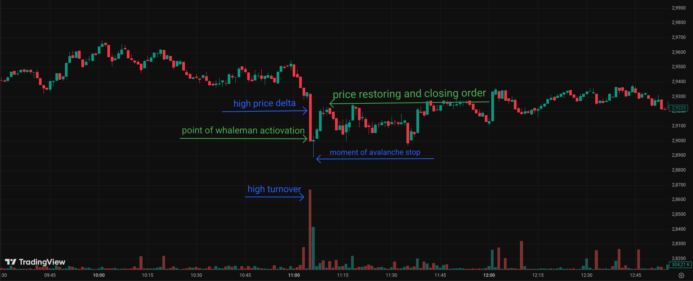
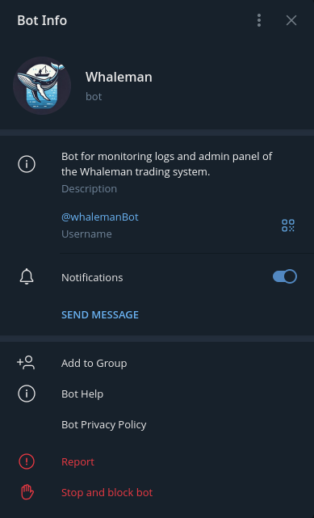
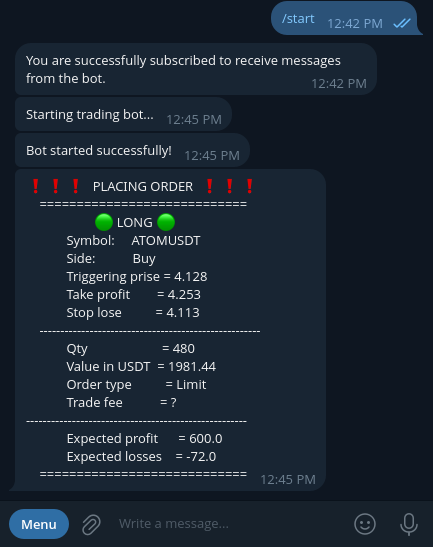
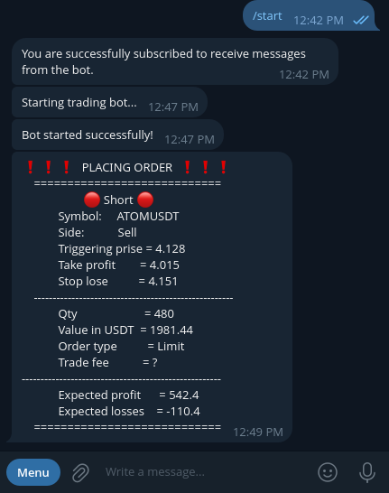

# 🐳 Whaleman


[Ukrainian version -> 🇺🇦](README.ua.md)

## **Whaleman** is a comprehensive automated system designed for **cryptocurrency trading**.
It consists of a [trading bot](#Trading-bot) and an [information and control bot](#Info-bot).

### 🤖 Trading bot
This bot performs **market analysis and trading** by connecting to the **Bybit** exchange API using the `pybit` library. It also interacts with the [info-control bot](#Info-bot) to provide logs and receive control commands _(functionality still in development)_.

### 📲 Info bot
This bot serves as the backend for a Telegram bot used to monitor the trading bot's operation and control it. It also assigns different user roles based on their level of access to the trading bot's features.

## Operating Principle and Core Idea
The entire bot is based on the idea of detecting **unfavorable market conditions** created by large players - market makers (or "whales") - through artificial and sudden price movements. Their goal is to raise or lower the price to the level where retail traders have placed their stop-loss orders, forcing them to close their positions at a **disadvantageous price**.

Such unfavorable situations follow a similar pattern:
+ **A sudden surge in trading volume (turnover)** compared to typical levels, as significant capital must flow through a trading pair to manipulate the price.
+ **A sharp price movement** compared to normal price dynamics, where the price rises or falls to levels where most of the exchange's orders are placed.

Such a situation, for example with a price drop, leads to an avalanche-like sell-off of assets at unfavorable prices by most traders trying to preserve at least some of their funds. This further amplifies the price movement toward extreme levels.
At this point, the whale begins buying up the currency at a price favorable to them and stops the avalanche, thereby restoring a normal price level for the trading pair.



It is at the moment when the avalanche-like movement begins that the `whaleman` system activates and starts buying up stop-loss orders alongside the whale who triggered the situation, thereby helping to restore the market.

## Trading features
In addition to the basic strategy, the bot also implements extra protection systems against erroneous trades:
- **Automatic placement of take-profit and stop-loss orders**, depending on the configuration. This helps protect the position in case the whale fails to stop the avalanche they initiated.
- **Purchase price averaging** by creating additional orders during the avalanche development.
- **Emergency order closure** in case of a "stuck" trade when the price does not return to the take-profit level within the expected time.
- **Ability to set a `sliding percent`** to avoid entering an unfavorable trade due to poor internet connection or sudden price changes.
- **Flexible bot behavior configuration** via a config file.

## Technical features
- **Flexible system configuration** using `JSON` config files.
- **User data storage** for the Telegram bot in an `SQLite` database.
- **Integration with a Telegram bot** for system monitoring and control.
- **Deployment via `Docker`** for quick startup and avoiding dependency issues.
- **Exchange connectivity** using `Socket` and `REST` APIs through the `pybit` library for trade execution and price monitoring.
- **Communication between the logging bot and trading bot** handled via `Socket`.
- **Microservices architecture** to separate the trading system from the control system.
- **Role-based access control** - division into admins and regular bot users.
- **Asynchronous `whaleman` system**, capable of handling a large number of Telegram users and trading pairs simultaneously.

## 🚀 Installing & Deployment

Installation and launch of the `whaleman` system are possible in two ways:
+ Direct installation on your system.
+ Installation using `Docker`.
However, before either option, you need to download the bot files using `git` or directly from GitHub:
```bash
git clone https://github.com/Klipar/Whaleman.git
```
After successful download, generate the configuration files and initialize the database:
```bash
cd whaleman && mkdir -p Configs && cp -r templates/* Configs/
```
And [configure configuration files](#Configs).
### Direct installation on your system
#### Requirements:
+ `Python` version>= 3.11. And its modules:
  + `pip`
  + `venv`
+ `Bash`

#### Installation and launch:
In the project directory, execute:
```bash
bash launch.sh
```
At the first run, the script will ask whether to create a virtual environment; confirm this by typing `(Yes/y)`. Subsequently, the script will simply reuse it.

### Installation using `Docker`
#### Requirements:
+ `Docker`
+ `Docker-compose`

#### Installation and launch:
In the project directory, execute:
```bash
docker-compose up
```
At the first run, this command will create the Docker image and start the container.
On subsequent runs, it will restart the created container.

## 🛠️ Configs
Before completing the installation and launching `whaleman`, it is necessary to configure the configuration files.
They can be edited in any text editor.
### 🤖 Trading bot config
The configuration file for the trading bot is located at `Configs/tradingBot.json`.
In this file, you need to configure the following parameters:
+ **"API Public Key"**
+ **"API Secret Key"**

Replace `***` with your account keys enclosed in quotes. If you don't have them yet, you can generate them via the following link: [Bybit API management](https://www.bybit.com/app/user/api-management).

#### Here you can also configure:
+ **"Category of trading"** - the trading method. By default, it is `'linear'`, which corresponds to classic derivatives. However, `inverse` and `spot` are also allowed (_`inverse` and `spot` are still in development_).
+ **"SettleCoin"** - the currency against which trading is conducted. By default, it is `USDT`, but other currencies are also allowed. The only note is that trading pairs in the next item should be written relative to the currency specified here.
+ **"Coins"** - the list of trading pairs the bot will trade.
+ **"Max Trading Balance in USDT"** - the balance the bot will trade with. Deal sizes are also calculated from this.
+ **"First step in percent from trading balance"** - a percentage calculated from the `Max Trading Balance in USDT`, which will be the initial deal size the bot will execute on the exchange upon detecting the required conditions.
+ **"Next steps prise in percent moving from last order prise"** - the percentage price movement towards the avalanche after which the bot will make an additional purchase to average the entry price of the position.
+ **"Multiplier to increase the deal value"** - a multiplier used to calculate the volume of the additional purchase. The additional purchase will be made according to the following formula:

``` Text
a = b * c
Where:
a - additional purchase volume
b - current position size
c - "Multiplier to increase the deal value"
```

+ **"Sliding percent from entering prise"** - this parameter serves to increase the chance of entering a position during very sharp price changes. The obtained percentage from the entry price is added in a disadvantageous direction for the user but increases the chance that the exchange will accept the deal. That is, if we want to buy, the calculated percentage of the current price will be added to the desired purchase price; in the case of selling, it will be subtracted.
+ **"Max count of candles for average a trade volume"** - sets the number of candles used to calculate the average trade volume (turnover). It can be set within the range \[1, 1000\], but recommended values are \[100, 1000\].
+ **"Candle time"** - the duration of one candle in minutes.
+ **"Take profit percent from entering prise"** - the percentage by which we expect the price to move in our favor. After reaching this movement, the deal will be closed.
+ **"Stop lose percent from entering prise"** - the expected adverse price movement. If this price is reached, the deal will be closed urgently to minimize losses.
+ **"leverage"** - since the main trading method of the bot is derivatives (futures), this parameter sets the leverage amount used for calculations. **It does not change the actual leverage value** for this coin but only uses it to calculate necessary values when making a deal.
+ **"Max Count of candle before allowed to close order on acceptable profit"** - the number of candles after which the order will be closed at an acceptable profit defined by `"Min acceptable profit for pre force closing"`, without waiting for closure by the `"Take profit percent from entering price"` parameter.
+ **"Min acceptable profit for pre force closing"** - the threshold percentage of price movement in our favor, after reaching which, if the order is prolonged for `"Max Count of candle before allowed to close order on acceptable profit"` candles, it will be closed.
+ **"Max Count of candle before force closing order"** - the maximum number of candles after which the order will be forcibly closed regardless of the current instrument price.
+ **"Max position percent from balance"** - the maximum size of the position including additional purchases that can be placed. Measured as a percentage of `"Max Trading Balance in USDT"`.
+ **"candles minimal move percents"** - a list of minimum price movement percentages required to open a position. The list is indexed starting from `1`; the index represents the number of candles used to compare the price movement against the value at that list index. For example, the 3rd element of this list calculates the percentage difference between the opening price of the 3rd candle and the closing price of the 1st candle (_the current candle is still open_).
+ **"Trigger turnover percent"** - minimum percentage of the average trading volume (turnover) required to execute a trade.
+ **"time factor for trading turnover"** - since we compare the trading volume of an open candle with the average volume of closed candles, these values need to be aligned. For this, they are linearly adjusted by the candle time (_currently `"linear"` is the only alignment method_).
+ **"No Trade"** - boolean parameter that enables or disables trading on the market (`True`/`False`).
+ **"Only Buy"** - boolean parameter; when set to `True`, only allows `Buy` trades, blocking `Sell`.
+ **"Only Sell"** - boolean parameter; when set to `True`, only allows `Sell` trades, blocking `Buy`.
+ **"All coins on exchange"** - boolean parameter that enables trading on all currency pairs on the exchange (_in development_).
> Enabling both `"Only Buy"` and `"Only Sell"` simultaneously will have the same effect as enabling `"No Trade"`.


### Logging bot config and database
The configuration file for the Telegram bot (admin panel) is located at `Configs/telegramBot.json`.
In this file, you need to configure the following parameter:
+ **"Telegram API token"** - your bot's token.
  You can obtain it using the Telegram bot [@BotFather](https://t.me/BotFather)

#### Here you can also configure:
+ Modify the message texts in the `success`, `already`, `never`, `Buy`, and `Sell` sections.
+ **"Users database"** - this parameter allows you to specify the location of the bot's user database.
+ In the `"Socket server"` section, you can also change the `"host"` and `"port"` parameters on which the internal `Whaleman` socket server will run.


## 🎬 Demo


<p float="left">
  
  
</p>
<p float="left">
  
  
</p>

## 📁 Repository structure
The detailed structure of the repository can be found [here ->](structure.txt).

## 👤 About the author
This project was created by me to deepen my skills in algorithmic strategy development, microservices, DevOps (Docker), API integration, and Telegram bots.

The entire system was actually developed back when I was still exploring the world of cryptocurrency, as it was something new for me (around 2023 - unfortunately, the git history hasn’t been preserved).
However, I only recently had the time to bring the project into a proper state and publish it.

If you'd like to learn more or have any feedback - I'm happy to connect!


Email: [bhdnkarpenko123@gmail.com](mailto:bhdnkarpenko123@gmail.com)

LinkedIn: [linkedin.com/in/bohdan-karpenko](https://www.linkedin.com/in/bohdan-karpenko-a84036376?utm_source=share&utm_campaign=share_via&utm_content=profile&utm_medium=android_app)

## ⚖️ License

This project is licensed under the terms of `GNU General Public License v3.0`.

You have the right to:
``` Text
use,
modify,
distribute this software code
```

provided that:
``` Text
all derivative works will also be open (copyleft),
you will retain a link to the author of the original project,
any changes/modifications must also be available under the same license.
```

The full text of the license is in the file - [LICENSE](LICENSE).
