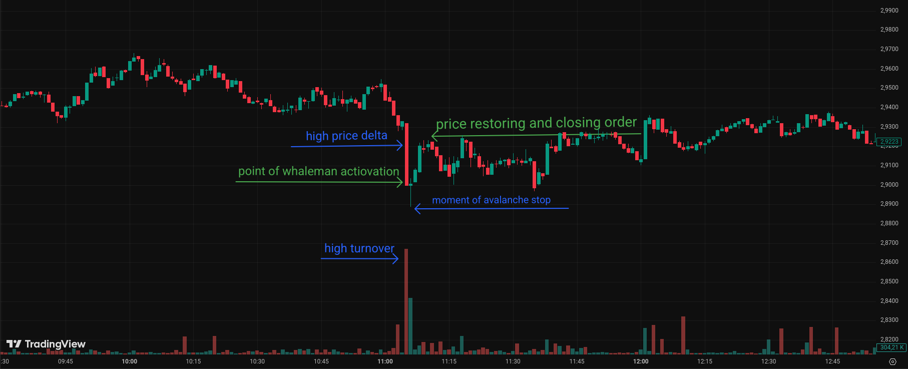
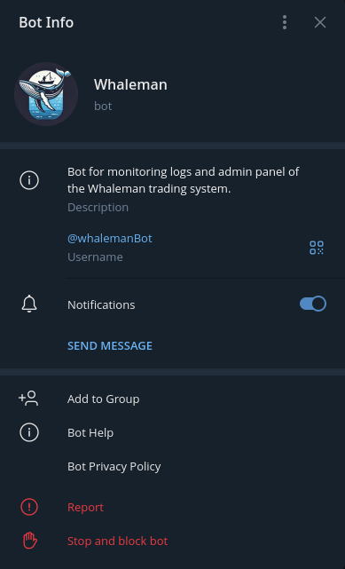
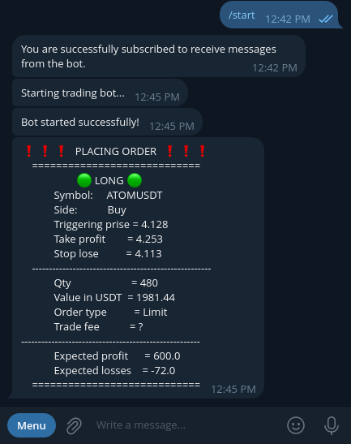
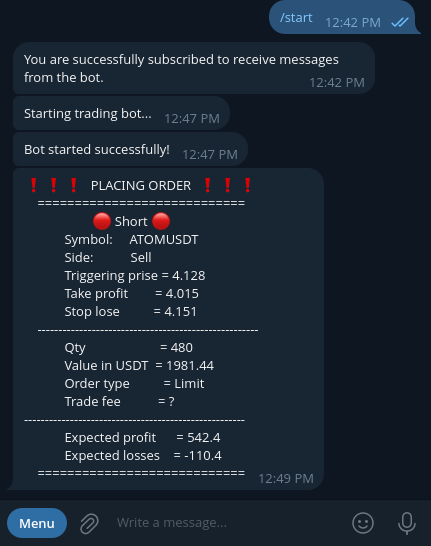

# Whaleman


[English version -> 🇬🇧](README.md)

## **Whaleman** - це комплексна автоматизована система що виконує торгівлю **криптовалютами**.
Вона складається з [торгового бота](#Trading-bot) та [інформаційно-керуючого бота](#Info-bot).

### Trading bot
Даний бот виконує **аналіз ринку та торгівлю** шляхом підключення до api біржі **BybiT** через інтерфейс бібліотеки `pybit`. Також він зв'язується з [інформаційно-керуючим ботом](#Info-bot) для надання логів та отримання команд керування _(ще в розробці)_.

### Info bot
Даний бот є бекендом телеграм бота з допомогою якого виконується моніторинг роботи торгового бота та його керування. Також він розділяє ролі користувачів за рівнем доступу до функцій торгового бота.

## Принцип роботи та основна ідея
Весь бот побудований на ідеї пошуку не вигідних ситуацій які спричиняють крупні гравці вони ж маркет мейкери або (кити) шляхом штучної та різкої зміни ціни. Їх мета підняти або опустити ціну до розміщення завершальних угод (stop loss orders) звичайних гравців та змусити їх закрити їх позиції за не вигідною для них ціною.

Такі не вигідні ситуації мають подібний патерн:
+ **Виникнення різкого сплеску об'ємів торгів (turnover)**, порівняно з його звичайними значеннями адже для маніпуляції ціною крізь валютну пару має пройти значний капітал.
+ **Різка зміна ціни**, порівняно з звичайною швидкістю, де ціна піднімається або падає до рівнів, де розміщено більшість ордері на біржі.

Така ситуація для прикладу з заниженням ціни призведе до лавиноподібного продажу активів по не вигідним цінам більшості гравців, з метою зберегти хотча б щось, що почне ще більше посилить ціновий рух пікових значень. В ций момент кит має почати викупати валюту по вигідній для нього ціні і зупинити лавину, цим самим відновивши нормальні значення ціни для валютної пари.



Саме в момент появи лавиноподібного руху активізується система `whaleman` та починає викуповувати stop loss угоди разом з китом, що спровокував цю ситуацію. Цим самим відновлюючи ринок.

## Trading features
Окрім базової стратегії бот також реалізовує додаткові системи захисту від помилкових угод:
- **Автоматична розстановка tate profit && stop loss угод**, залежно від конфігурації. Це дозволяє вберегтись у випадку нездатності кита зупинити створену ним лавину.
- **Усереднення ціни купівлі** шляхом створення додаткових угод впродовж розвитку лавини.
- **Аварійне закриття угод** у випадку "застою" угоди, коли ціна не повернулась за очікуваний час до take profit позиції.
- **Можливість задавати `sliding percent`**, щоб уберегтись від входження в невигідну угоду через погане з'єднання з інтернетом та занадто різку зміну ціни.
- **Гнучні налаштування поведінки бота** з допомогою конфігураційного файлу.
<!--  -->

## Tecnical features
- **Використання конфігураційних файлів в форматі `JSON`** для гнучкого налаштування поведінки системи.
- **Використання бази даних `SQLite`** для збереження користувачів телеграм бота.
- **Використання телеграм бота для моніторингу роботи системи та керування нею**.
- **використання `Docker`** для швидкого запуску та уникнення проблем з залежностями.
- **використання `Socket` та `REST` api зєднаннь з біржою через `pybit`** бібліотеку для укладання угод та моніторингу ціни.
- **використання `Socket`** для взаємодії бота логування та торгового бота.
- **використання `Microservices Architecture`** для розділення торгової системи та системи керування.
- **Реалізація ролей в системі керування та поділ на адмінів та простих користувачів бота**.
- **Система whaleman є асинхронною**, що дає можливість одночасно опрацьовувати як велику кількість телеграм користувачів так і велику кількість валютних пар на біржі.

## Installing & Deployment

Встановлення та запуск системи `whaleman` можливий в 2 варіантах:
+ Встановлення напряму на вашій системі.
+ Встановлення з допомогою `Docker`.
Однак перед обома з варіантів вам потірбно завантажте файли бота з допомогою `git` або напряму з github:
```bash
  git clone https://github.com/Klipar/Whaleman.git
```
Після успішного скачування згенеруйте конфігураційні файли та ініціалізуйте базу даних:
```bash
  cd whaleman && mkdir -p Configs && cp -r templates/* Configs/
```
Та [налаштуйте конфігураційні файли](#Configs).
### Встановлення напряму в систему
#### Вимоги:
+ `Python` версії>= 3.11. Tа його модулі:
  + `pip`
  + `venv`
+ `Bash`

#### Встановлення та запуск:
в дерикторії проєкту виконайте:
```bash
  bash launch.sh
```
При першому запуску скрипт запитає чи створити віртуальне середовище, підтвердіть це ввівши `(Yes/y)`. В подальшому скрипт просто використовуватиме його повторно.

### Встановлення з допомогою `Docker`
#### Вимоги:
+ `Docker`
+ `Docker-compose`

#### Встановлення та запуск:
в дерикторії проєкту виконайте:
```bash
  docker-compose up
```
При першому запуску дана команда створить Docker image та запустить контейнер.
При повторних запусках воно перезапускатиме створений контейнер.

## Configs
Перед завершенням встановлення та запуском `whaleman` необхідно налаштувати конфігураційні файли.
Їх можна корегувати в будь якому текстовому редакторі.
### Trading bot config
Конфігураційний файл для торгового бота знаходиться за шляхом `Configs/tradingBot.json`.
В цьому файлі вам необхідно налаштувати такі параметри:
+ **"API Public Key"**
+ **"API Secret Key"**

Замість `***` вставте ключі до вашого акаунту в лапках. Якщо в вас їх ще немає ви можете їх згенерувати за посиланням: [Bybit API management](https://www.bybit.com/app/user/api-management).

#### Також тут можна налаштувати:
+ **"Category of trading"** - спосіб торгівлі. За замовчуванням це 'linear' що відповідає класичним деривативам. Однак також допустимі `inverse` та `spot` _(`inverse` та `spot` ще в розробці)_.
+ **"SettleCoin"** - валюта відносно якої буде вестися торг. За замовчуванням це `USDT` однак допустима і інша валюта. Єдиним зауваженням є те що валютні пари в наступному пункті варто записувати в відношенні до вказаної валюти тут.
+ **"Coins"** - перелік валютних пар якими торгуватиме бот.
+ **"Max Trading Balance in USDT"** - тут можна задати баланс бота яким він торгуватиме. Також від нього рахуються розміри угод.
+ **"First step in percent from trading balance"** - відсоток що рахується від `Max Trading Balance in USDT` і який буде первинним розміром угоди яку укладатиме бот із біржею при виявленні необхідних умов.
+ **"Next steps prise in percent mowing from last order prise"** - відсоток руху ціни в бік лавини після якого бот виконає докупку з цілюю усереднення середньої ціни входу в позицію.
+ **"Multiplier to increase the deal value"** - це множник з допомогою якого вираховується обє'єм докупки. Докупка виконуватиметься за наступною формулою:
``` Text
a = b * c
Де:
a - об'єм угоди докупки
b - нинішній розмір позиції
c - "Multiplier to increase the deal value"
```

+ **"Sliding percent from entering prise"** - цей параметер служить для збільшення шанцу встигнути увійти в позицію при дуже різких змінах ціни. Отриманий відсоток від ціни входу в договір додається в невигідному для користувача ключі однак збільшує шанс того що біржа прийме угоду. Тобто якщо ми хочемо купити то отримане відсоткове значення від нинішньої ціни додасться до бажаної ціни покупки у випадку продажу відніметься.
+ **"Max count of candles for average a trade volume"** - задає кількість свічок які буде використано для обчислення середнього значення об'ємів торгів (turnover). Може бути задане в межах від \[1, 1000\], однак рекомендовані значення \[100, 1000\].
+ **"Candle time"** - час однієї свічки в хвилинах.
+ **"Take profit percent from entering prise"** - на скільки відсотків ми очікуємо що ціна рухатиметься в нашу користь. Після досягнення відповідного руху угода завершиться.
+ **"Stop lose percent from entering prise"** - на скільки ми очікуємо рух ціни не в нашу користь. У випадку досягнення цієї ціни угода буде аварійно завершена з метою мінімізації втрат.
+ **"leverage"** - оскільки основний спосіб торгівлі ботом це деривативи (ф'ючерси) то даний параметер задає величину кредитного плича для розрахунків. **Він не міняє справжнє значення плеча** для цієї монети а лише використовує це значення для обрахунків необхідних значень при укладанні договору.
+ **"Max Count of candle before allowed to close order on acceptable profit"** - Після якої кількості свічок при вигідному русі ціни на `"Min acceptable profit for pre force closing"` відсотків угоди завершиться не очікуючи закриття через параметер `"Take profit percent from entering prise"`.
+ **"Min acceptable profit for pre force closing"** - Порогове значення відсотку руху ціни в нашу користь після досягнення якого у випадку затягнутої угоди на `"Max Count of candle before allowed to close order on acceptable profit"` свічок вона буде завершена.
+ **"Max Count of candle before force closing order"** - максимальна кількість свічок після яких угода буде завершеною, не залежно від нинішної вартості інструменту.
+ **"Max position percent from balance"** - максимальний розмір угоди враховуючи докуповування який може бути укладений. Вимірюється в відсотках від `"Max Trading Balance in USDT"`.
+ **"candles minimal move percents"** - список відсотків мінімального руху ціни для відкриття позиції. Список нумеруєтсья з лівого краю починаючи з `1`, порядковий номер елементу означає кількість свічок які буде викорситано для порівняння руху ціни із значенням на цьому номері списку. У випадку з `3` елементом цього списку буде пораховано відсоткову різницю в ціні між відкриваючою ціною `3` свічки і закриваючою ціною `1` свічки _(нинішня ще не завершена свічка)_.
+ **"Trigger turnover percent"** - Мінімальна кількість відсотків від середнього значення об'ємів торгів (turnover) яка має бути для укладення угоди.
+ **"time factor for trading turnover"** - оскільки для підрахунку об'ємів торгів (turnover) ми будемо порівнювати об'єм торгів незакритої свічки з середнім об'ємом торгів закритих свічок потірбно вирівняти ці значення. Для цього вони будуть лінійно зсунуті на час свічки _(покищо `"linear"` це єдиний варіант вирівнювання)_.
+ **"No Trade"** - це булевський параметер який дозволяє систему укладати договори на ринку(`True`/`False`)
+ **"Only Buy"** - булевський параметер, при значенні `True` дозволяє лише `Buy` угоди, блокуючи `Sell`.
+ **"Only Sell"** - булевський параметер, при значенні `True` дозволяє лише `Sell` угоди, блокуючи `Buy`.
+ "All coins on exchange" - булевський параметер, що дозволяє почати торг на всіх валютних парах біржі _(перебуває в розробці)_
> одночасне ввімкнення параметрів `"Only Buy"` та `"Only Sell"` призведе до еффекту ідентичному ввімкненню `"No Trade"`.


### Logging bot config and database
Конфігураційний файл для телеграм бота - адмін панелі знаходиться за шляхом `Configs/telegramBot.json`.
В цьому файлі вам необхідно налаштувати параметер:
+ **"Telegram API token"** - токен вашого бота.
Його можна отримати з допомогою телеграм бота [@BotFather](https://t.me/BotFather)

#### Також тут можна налаштувати:
+ Змінити текст повідомлень в секціях `success`, `already`, `never`, `Buy` та `Sell`
+ **"Users database"** - в цьому параметрі можна задати розміщення бази даних користувачів бота.
+ Також в секції `"Socket server"` можна змінити параметри `"host"` та `"port"` на якому запуститься внутрішній socket server `Whaleman`.

## Demo


<p float="left">
  
  
</p>
<p float="left">
  
  
</p>


## 📁 Структура репозиторію
Детальна структура репозиторію знаходиться [тут ->](structure.txt).

## 👤 About the author

Цей проєкт створений мною для поглиблення навичок в розробці алгоритмічних стратегій, мікросервісах, DevOps (Docker), API-інтеграції та Telegram-ботах. Якщо хочете дізнатись більше або маєте фідбек — буду радий контакту!

Email: [bhdnkarpenko123@gmail.com](mailto:bhdnkarpenko123@gmail.com)

LinkedIn: [linkedin.com/in/bohdan-karpenko](https://www.linkedin.com/in/bohdan-karpenko-a84036376?utm_source=share&utm_campaign=share_via&utm_content=profile&utm_medium=android_app)

## ⚖️ License

Цей проєкт ліцензовано під умовами `GNU General Public License v3.0`.

Ви маєте право:
``` Text
використовувати,
змінювати,
розповсюджувати цей програмний код
```

за умови, що:
``` Text
всі похідні роботи будуть також відкриті (copyleft),
ви зберігатимете посилання на автора оригінального проєкту,
будь-які зміни/модифікації також повинні бути доступні під цією ж ліцензією.
```

Повний текст ліцензії — у файлі [LICENSE](LICENSE).
